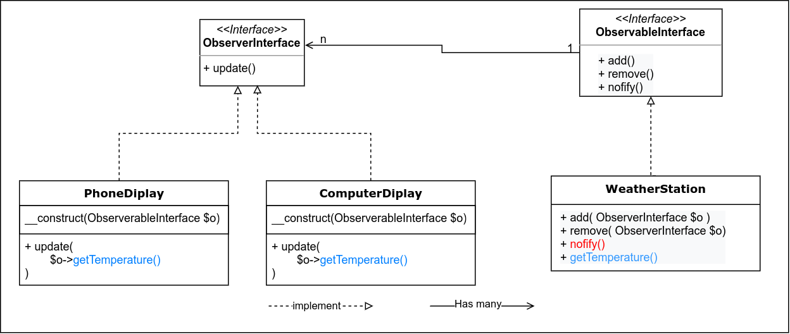
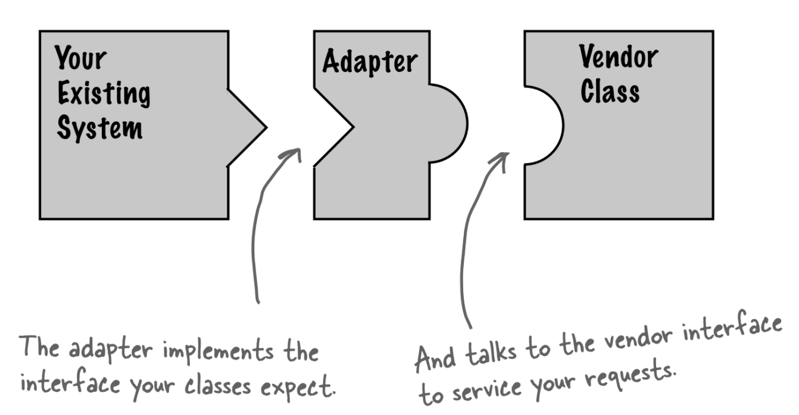
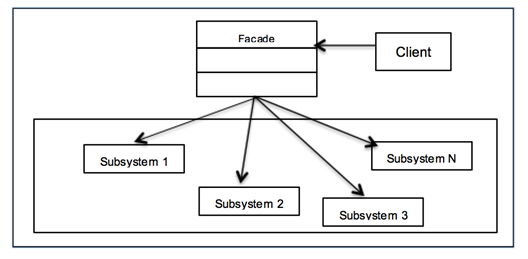

Design Pattern by HeadFirst Design Pattern Book.

# 1. Strategy Pattern (Policy Pattern)


## Design Principle:
- Identify the aspects of your application that vary and seperate them from what stays the same.

    *when you have an codes to change, investigate new requirements carefully then you should know
    what behavior need to separates from code block and what need stays the same.*

## Design Principle:
- Program to an interfacce, not an implementation ( 1 of 5 principals in SOLID )


# 2. Observer Pattern



## Design Principle:
- The observer pattern defines a one-to-many dependency between objects so that when one object changes state, all of its dependents are notified and updated automatically.


# 3. Decorator Pattern

## Design Principle:
- Decorator is a structural design pattern that lets you attach new behaviors to objects by placing these objects inside special wrapper objects that contain the behaviors.

# 4.1 Factory Method (a.k.a Virtual Constructor)

- This part is an example for Factory Method. Part 2 belongs to Aabstract factory is here.

```
This belongs to creational design pattern that provides an interface for creating objects in a supperclass, but allows subclasses to alter/decide type of object that will be created.
```

# Design Principle:

- Depend upon abstractions. Do not depend upon concrete classes.
- Factory Pattern encapsulate object creation

# Real life example:

- Imagine you're using Mysql database connections in your backend system.
- One day customer want to switch to use MYSQL Server for some purposes.
- Then we need create new class for MYSQL Server with existing interface using by Mysql before.
- And edit you backend code to use new connection.
- In future, customer wants to change to other DB connector then you needs to do the same thing above...
- Imagine you have 300 lines of code using this connector, then you need edit all of them, it's terrible.

# Why Factory Pattern helps here:

- Decoupling the creation creation of object/interface from your code.
- When you need to edit, add or remove some connector, just need to edit 1 method without affect other classes.

# Cons:

- Loose Coupling
- Reusability
- Easier to maintain

Design Pattern by HeadFirst Design Pattern Book.

# 4.2 Abstract Factory

```
Provides an interface for creating families of related or dependent object without specifying their concrete class
```


An example for PizzaStore:


Result:


The factory pattern construct a single object != The abstract factory construct multiple objects

As you can see in 2 pictures above, the Abstract Factory actually looks like a Factory Method. Each method is declared
abstract and subclasses override it to create some objects.

The job of an Abstract Factory is to define an interface for creating a set of products. Each method in that interface
is responsible for creating a concrete product, and we implement a subclass of Abstract Factory to supply those
implementations. So factory methods are a natural way to implement your product methods in your factories.

```angular2html
Absctract factory contains multiple factory methods inside
```

# 5. Singleton Pattern
Singleton is a creational design pattern that lets you ensure that a class has only one instance, while providing a global access point to this instance.

Clients may not even realize that they’re working with the same object all the time.


```
Identify the aspects of your application that vary and seperate them from what stays the same. when you have an codes to change, investigate new requirements carefully then you should know what behavior need to separates from code block and what need stays the same.
```
## Design Principle:


# 6. Adapter pattern and Facade pattern 

# 6.1 Adapter Pattern (aka Wrapper Pattern)

> The adapter pattern convert the interface of a class into another interface clients expect. Adapter lets classes work together that couldn’t otherwise because of incompatible interfaces.

### Adapter Pattern used when

When a class that you need to use doesn't meet the requirements of an interface.
Exposed to legacy code may encounter an old interface needs to be converted to match new client code *Adapters* allows programming components to work together that otherwise wouldn't because of mismatched interfaces.

Adapter pattern motivation is that we can reuse existing software if we can modify the interface.




#### There are two kinds of Adapters

1. **Class Adapter**
   *uses `inheritance`* [multiple inheritance] *not supported in *java* nor *php*.
   can only wrap a class It cannot wrap an interface since by definition it must derive from some base class.

1. **Object Adapter**
   *uses `Object composition`* composition and can wrap classes or interfaces, or both. It can do this since it contains, as a private, encapsulated member,the class or interface object instance it wraps.


Useful video:
[[Youtube]](https://youtu.be/2PKQtcJjYvc)
## 6.2 Facade Pattern (The principle of least knowledge)

Belong to structural pattern.

Provide a unified interface to a set of interfaces in a subsystem. Facade defines a higher-level interface that makes
the subsystem easier to use.

### Facade used when

    when you want to simplify a complex system.

* Facades don't encapsulate .
* Facade Pattern allows to avoid tight coupling between client and subsystem.

From


to


Real example:



Useful video:
[[Youtube]](https://www.youtube.com/watch?v=K4FkHVO5iac&t=470s)

